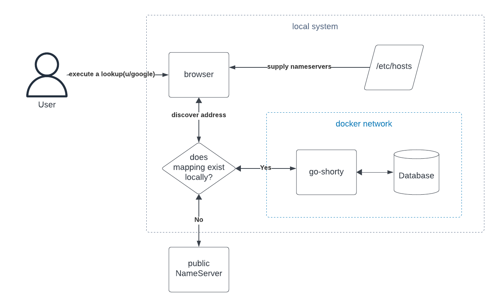

# go-shorty

URL shortener made in go.

## Scope

The end goal is to be able to run a local version of `go-shorty` and have a
local database of URLs that are associated with shortened URLs. The final design
should address the following goals:

- Users can benefit from shortened urls in the browser to save time. Example:
  `u/hn` could route to HackerNews
- Over 80% of code is tested
- Everything runs locally(docker compose or kind cluster)
- Prefer libraries over frameworks
- CI: Linting, formatting, testing, vulnerability scanning, conventional commits
- CD: Build Go binaries, build docker containers and publish to GitHub
  Packages/Releases

Here's an idea of what the target architecture would look like, this is not
fleshed out so it could change based on what's possible:

